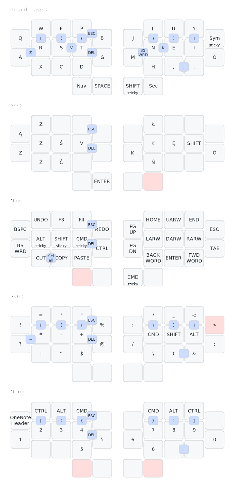

# ZMK config for my Hummingbird keyboard

## Keymap

*Generated with [keymap-drawer](https://github.com/caksoylar/keymap-drawer)*

[this layout](https://caksoylar.github.io/keymap-drawer?keymap_yaml=H4sIAAAAAAAC_42UbXPSQBDH3_dTrI9X9aoltLSmPoUklFqeTKDYVmQoxIFpIEwIOkzFGUfHL-Abx2_i-NLyvdzbu1CYUgYGfptb_nu3t7c5vzEKhpG-BhCEUTuo-3IMF4O-30EbhUOPQxh8GuiQ5NAM_GG3h8_bHKL2sHuGjxqHVhj06_1O73wUR5Cn0-t5ofSM13BmLxyIlVreh8bQj-rkEY4NeEOsEjPEEjFNfE3MESvEY-IFJuiOuhzaOgyiTvN8NCa_QXSILrFM3CfmiQWiTTwgFolviSbRImaJjDOyj2V046OcvWSY9lUu2YNM-Vo2rtdEi9Th9PI7h8lfDozN_yZf58cn9J385nAkHYc4-sbh8hePV_n3E11_0PVjqpidwS6UbUc-itSEjUZ9T4e257fGNcwI94AZpd2SyaFSsIocMnjCmS0Oji1GpX2olDhki3kbBYZTFZNaCBcDWNqFqmOp2Y3c3Lb54mpIt5m35p1m2cnRalaBQ47WsYgOsWykUVPBmcxi6RiFhlvGhNKGeQjVomNNt5qpWsqxYMNXlbi2PmOiGthHshXZLXnQ7Lmy-JEPt5W9p6yu7ENp68Rn025gL-ZTkOKXKuiOshvSPpKjV3L0RDZhXjYgFVI2dk7aPan-LNXviXeJ74jr8v_78Q5uMoVhF1ug2PMKQeRB1mu0vDA-EDpTKlbcUjSQblKQPyGgCSQFtgS2BVICOwK7Ak8FNmfb_krFbuzTpX_W1ppB9yzAO2UD-riPBN5EiaQ4zHMdjtD46Jy7bGqxMoXKHaU8XKrcRGVCKU-WKvFKTKSUMn49lgVo-KZp2ypgb5GSy9sNT2lhOuxLPD_KpopZwSlbbdpdDNqNg2orBolqaypofbWQnZmyP1gtJDlzpuxixdRSs0cxZiuvtKVi8IqLyynWj92WnYv3juegxWV2PR8avq9WwWt1WiHcrxbXlW6pxf3wH-zda7OFBwAA)

